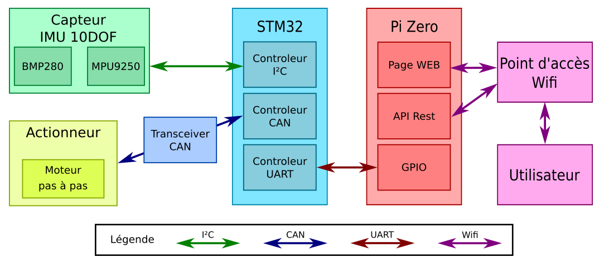
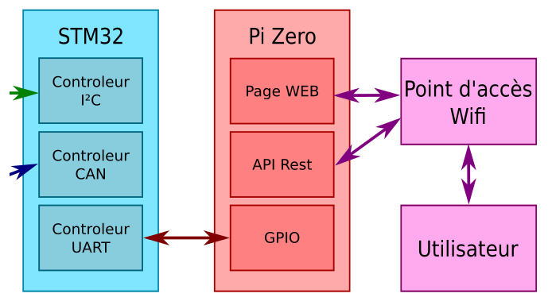
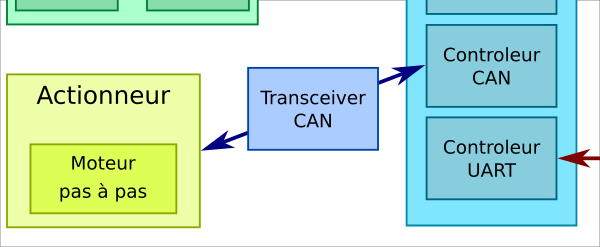
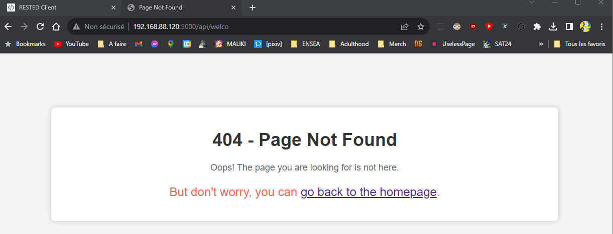
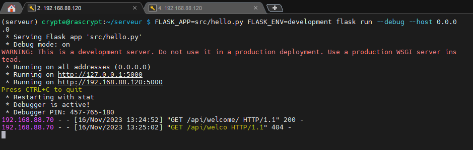
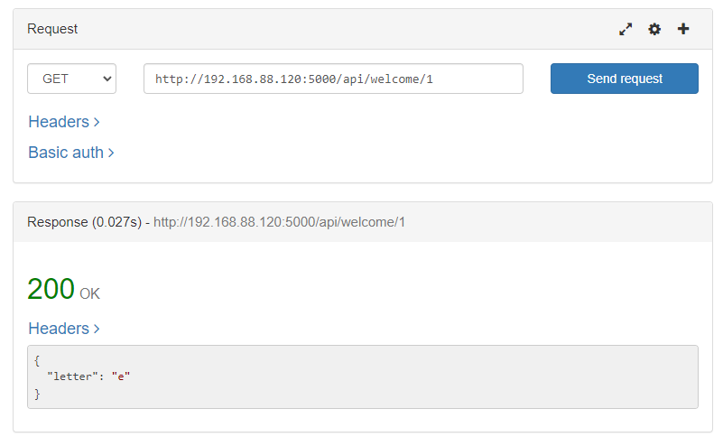
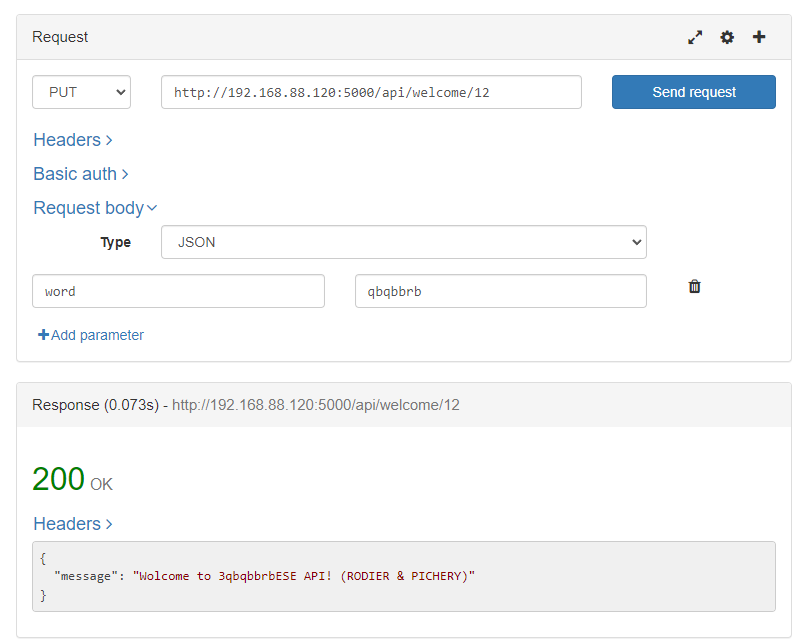
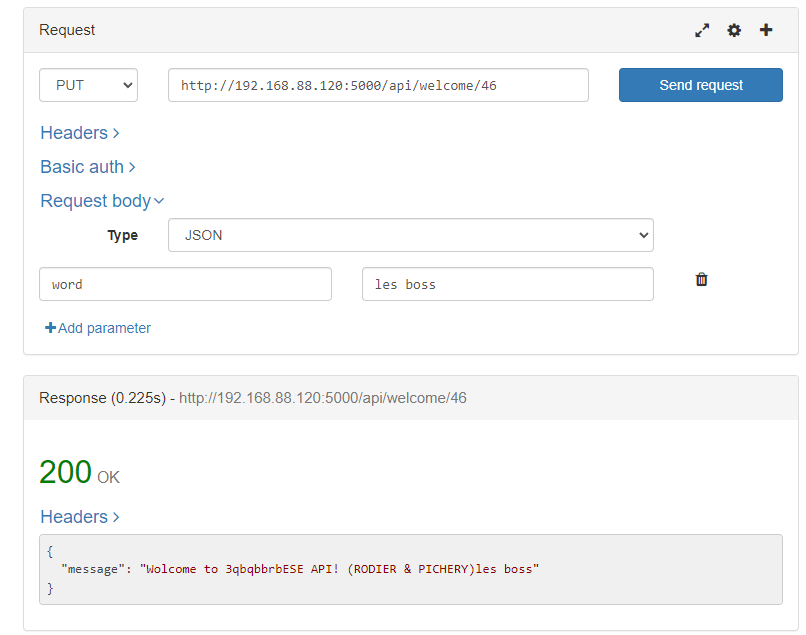

# TP bus et réseaux

#### Auteurs :
- [B. Rodier](https://github.com/LirokWid)
- [M. Pichery](https://github.com/MaximePich)


## Introduction

Ce projet à pour but d'interfacer une carte STM32F446 connectée à un capteur de température et de pression BMP280 et un moteur pas à pas connecté via CAN.
Une raspberry pi est connectée via UART à la carte STM32F446 et permet de récupérer les données et les rendres accessibles via une API REST.




## TP1 - Bus I2C
## TP2 - Interfacage STM32 - Raspberry Pi


### Paramètrage de la raspberry pi
Pour pouvoir communiquer avec la carte STM32, il faut activer l'UART et désactiver le bluetooth sur la raspberry pi. Pour cela, il faut modifier le fichier /boot/config.txt et ajouter la ligne suivante :
```bash
enable_uart=1
dtoverlay=disable-bt
```
### Test de la liaison UART

On teste ensuite la liason uart avec minicom :
```bash
sudo minicom -D /dev/ttyAMA0
```
On peut rentrer les commandes `GET_x` dans minicom et la carte STM32 répondra avec les valeurs des capteurs grace à la fonction `Print_RESULT_float`  :

```c
void Print_RESULT_float(enum CMD_type CMD, float val)
{
	switch(CMD)
	{
	int uartTxStringLength = 0;
	case GET_T:
		uartTxStringLength = snprintf((char *)uartTxBuffer,UART_TX_BUFFER_SIZE, "T = + %2.2f_C\r\n", val);
		HAL_UART_Transmit(&huart4, uartTxBuffer, uartTxStringLength, HAL_MAX_DELAY);
		break;
	case GET_P:
		uartTxStringLength = snprintf((char *)uartTxBuffer,UART_TX_BUFFER_SIZE, "P = +%8.2f_Pa\r\n", val);
		HAL_UART_Transmit(&huart4, uartTxBuffer, uartTxStringLength, HAL_MAX_DELAY);
		break;
	case GET_A:
		uartTxStringLength = snprintf((char *)uartTxBuffer,UART_TX_BUFFER_SIZE, "A = %3.0f_Degree\r\n", val);
		HAL_UART_Transmit(&huart4, uartTxBuffer, uartTxStringLength, HAL_MAX_DELAY);
		break;
	case GET_K:
		uartTxStringLength = snprintf((char *)uartTxBuffer,UART_TX_BUFFER_SIZE, "K = %3.0f\r\n", val);
		HAL_UART_Transmit(&huart4, uartTxBuffer, uartTxStringLength, HAL_MAX_DELAY);
		break;
	}
}
```

Tableau des réponses :
| Commande | Réponse |
| --- | --- |
| GET_T | Température |
| GET_P | Pression |
| GET_A | Angle du moteur |
| GET_K | Coefficient du BMP280 |


## TP3 - Interface REST

Dans ce TP, on va créer une API REST qui permettra de récupérer les données des capteurs de la carte STM32. Pour cela, on va utiliser le framework Flask.

### Installation du serveur

On installe les derniers packages pythons sur la raspberry pi :
```bash
sudo apt-get update
sudo apt install python3-pip
```
On créé ensuite une arborescence de serveur sur la Raspberry Pi :















## TP4 - Bus CAN
## TP5 - Intégration globale


# ddsv
## sdf
#### efef

fefe