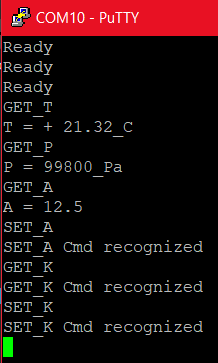
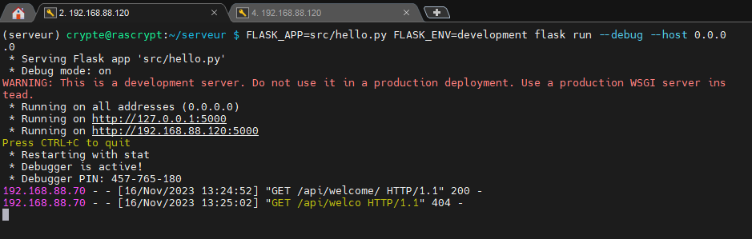
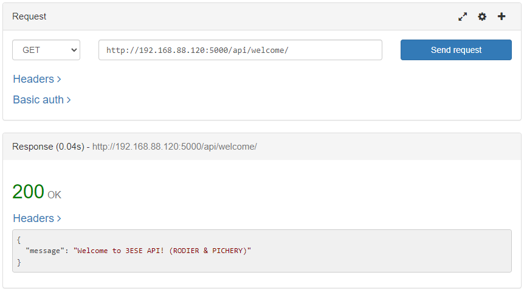
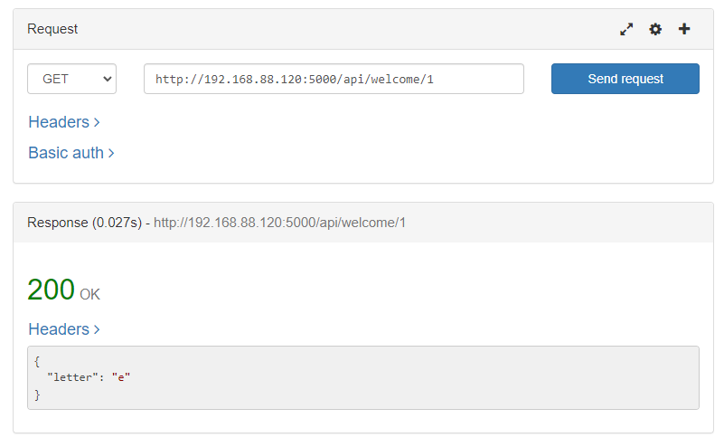
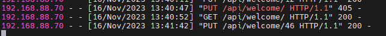
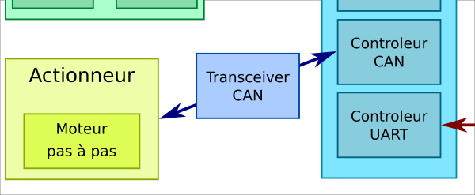

# TP bus et réseaux

#### Auteurs :
- [B. Rodier](https://github.com/LirokWid)
- [M. Pichery](https://github.com/MaximePich)


## Introduction

Ce projet à pour but d'interfacer une carte STM32F446 connectée à un capteur de température et de pression BMP280 et un moteur pas à pas connecté via CAN.
Une Raspberry pi est connectée via UART à la carte STM32F446 et permet de récupérer les données et les rendre accessibles via une API REST.


## TP1 - Bus I2C## TP 1 - Bus I2C

En premier lieu nous avons appris à communiquer avec une carte doté d'une liaison I2C.

Cette carte comporte 2 capteurs
- le BMP280 (Température, Pression atmosphérique et Altitude) 
- MPU9250 (Accéléromètre 3 Axes)

### Capteur BMP280

Pour récupérer des données de température, il nous faut écrire un driver permettant de simplifier la communication avec le composant via son bus I2C.

A partir de la datasheet du BMP280 nous avons identifié les éléments important pour établir la communication.

| Variable              | Valeur|
|---                    |---|
| Adresse I2C           | 0x76 si VDO = GND|
|                       | 0x77 si VDO = VDD|
| Registre "id"         | Adresse = 0xD0|
|                       | Valeur = 0x58|
| Registre "ctrl_meas"  |Adresse = 0xF4|
|                       | mode[1:0] = 11b|
| Registre "calib"      | De 0x88 à 0xA1|
| Registre "temp_xlsb"  | Adresse : 0xFC|
| Registre "temp_lsb"   | Adresse : 0xFB| 
| Registre "temp_msb"   | Adresse : 0xFA| 
| Registre "press_xlsb" | Adresse : 0xF9| 
| Registre "press_lsb"  | Adresse : 0xF8| 
| Registre "press_msb"  | Adresse : 0xF7| 


Les registres relatifs à "press" et "temp" stockent les valeurs lue par le capteur de pression et de température.
Elles sont stockées sous la forme d'un unsigned sur 19bit.

Grâce à des fonctions présentes sur les pages 45 et 46 de la datasheet du BPM280, il est possible de calculer les pressions et températures compensées.

### Setup du STM32

Pour ce TP nous avons besoin de mettre en place plusieurs connections pour communiquer avec différents capteurs et carte électronique.


Voici la liste de toutes les connections ainsi que leurs paramètres que nous avons établie (certaines serviront pour la suite du TP).

#### USART2

- USART_TX -> PA2
- USART_RX -> PA3

| Variable      | Valeur|
|---            |---|
| Baud Rate     | 115 200 Bit/s|
| Word Length   | 8 Bits (including Parity)|
| Parity        | None|
| Stop Bites    | 1|


#### UART4

- UART4_TX -> PA0
- UART4_RX -> PA1

| Variable      | Valeur|
|---            |---|
| Baud Rate     | 115 200 Bit/s|
| Word Length   | 8 Bits (including Parity)|
| Parity        | None|
| Stop Bites    | 1|

#### CAN1

- CAN1_RX -> PB9
- CAN1_TX -> PB8

| Variable                      | Valeur|
|---                            |---|
| Prescaler                     | 5|
| Time Quanta in Bit Segment 1  | 1|
| Time Quanta in Bit Segment 2  | 2|
| ReSynchronization Jump Widht  | 1|

#### I2C1

- I2C1_SDA -> PB7
- I2C1_SCL -> PB6

| Variable          | Valeur|
|---                |--|
| I2C Speed Mode    | Standart Mode|
| I2C Clock Speed   | 100 000 Hz|


Afin de tester de notre driver, nous avons créé des fonctions permettant d'afficher les données lues par le capteur BMP280 sur la console de notre PC via la liaison USART2.

Pour que la liaison fonctionne avec le PC nous devons rediriger l'utilisation de la fonction printf vers cette liaison USART2 avec le code fournit ci-dessous à ajouter dans le fichier "stm32f4xx_hal_msp.c".

```C
/* USER CODE BEGIN PV */
extern UART_HandleTypeDef huart2;
/* USER CODE END PV */
```

```C
/* USER CODE BEGIN Macro */
#ifdef __GNUC__ /* With GCC/RAISONANCE, small printf (option LD Linker->Libraries->Small printf    set to 'Yes') calls __io_putchar() */
#define PUTCHAR_PROTOTYPE int __io_putchar(int ch)
#else
#define PUTCHAR_PROTOTYPE int fputc(int ch, FILE *f)
#endif /* __GNUC__ */
/* USER CODE END Macro */
```

```C
/* USER CODE BEGIN 1 */
/**
  * @brief  Retargets the C library printf function to the USART.
  * @param  None
  * @retval None
  */
PUTCHAR_PROTOTYPE
{
  /* Place your implementation of fputc here */
  /* e.g. write a character to the USART2 and Loop until the end of transmission */
  HAL_UART_Transmit(&huart2, (uint8_t *)&ch, 1, 0xFFFF);

  return ch;
}
/* USER CODE END 1 */
```
### Communication I2C

Avec le driver que nous avons écris nous pouvons communiquer avec le BMP280.

```C
#include "BMP280.h"
```
```C
BMP280_HandleTypedef bmp280;
bmp280_params_t bmp_params;
```
Paramètres du BMP280 :
```C
  bmp280_init_default_params(&bmp_params);
  bmp280.addr = BMP280_I2C_ADDRESS_1;
  bmp280.i2c = &hi2c1;
  bmp280_init(&bmp280,&bmp_params);
```
```C
void bmp280_init_default_params(bmp280_params_t *params)
{
	params->mode = BMP280_MODE_NORMAL;
	params->filter = BMP280_FILTER_OFF;
	params->oversampling_pressure = BMP280_STANDARD;
	params->oversampling_temperature = BMP280_STANDARD;
	params->oversampling_humidity = BMP280_STANDARD;
	params->standby = BMP280_STANDBY_250;
}
```
Le code ci-dessus permet d'initialiser les paramètres du BMP280 avec les valeurs par défaut.

Avec la fonction 'bmp280_read_float' on récupère les valeurs de température et de pression que le capteur lis, on les convertis en float et on les affiches sur la console de notre PC.

```C
int bmp280_read_float(BMP280_HandleTypedef *dev, float *temperature, float *pressure,float *humidity)
{
	int32_t  fixed_temperature;
	uint32_t fixed_pressure;
	uint32_t fixed_humidity;
	if (bmp280_read_fixed(dev, &fixed_temperature, &fixed_pressure,humidity ? &fixed_humidity : NULL))
	{
		*temperature = (float) fixed_temperature / 100;
		*pressure = (float) fixed_pressure / 256;
		if (humidity)
			*humidity = (float) fixed_humidity / 1024;
		return 1;
	}

	return 0;
}
```

(Nous avons écris un shell au début pour tester le BMP280 qui a ensuite été modifié pour être utilisé avec la Raspberry pi zero sur l'UART4)

Avec le pseudo-shell que nous avons écris nous pouvons envoyer des commandes à la STM pour démarrer la récupération des valeurs du capteur BMP280 puis la retranscription de ses valeurs sur la console de notre PC avec des printf.

```C
#include "uart4.h"

char RxBuff[RX_BUFF_SIZE] = {0};
uint8_t uartTxBuffer[UART_TX_BUFFER_SIZE];
enum CMD_type *pointerCMD = Null;

void Prepare_Receive(enum CMD_type *pCMD)
{
	HAL_UART_Receive_IT(&huart4, RxBuff, RX_BUFF_SIZE);
	pointerCMD = pCMD;
	int uartTxStringLength = snprintf((char *)uartTxBuffer,UART_TX_BUFFER_SIZE, "Ready\r\n");
	HAL_UART_Transmit(&huart4, uartTxBuffer, uartTxStringLength, HAL_MAX_DELAY);
	printf("Ready\r\n");
}
```
Toute nos commandes font 6 caractères (\n compris) donc une fois le BUFFER de réception rempli on compare la chaîne de caractère avec celle reçue pour reconnaitre ou non la commande envoyé par l'utilisateur.

```C
void HAL_UART_RxCpltCallback(UART_HandleTypeDef *huart)
{

	if     ((strcmp(RxBuff, "GET_T\r"))==0) *pointerCMD = GET_T;
	else if((strcmp(RxBuff, "GET_P\r"))==0) *pointerCMD = GET_P;
	else if((strcmp(RxBuff, "SET_K=" ))==0) *pointerCMD = SET_K;
	else if((strcmp(RxBuff, "GET_K\r"))==0) *pointerCMD = GET_K;
	else if((strcmp(RxBuff, "GET_A\r"))==0) *pointerCMD = GET_A;
	else
	{
		int uartTxStringLength = snprintf((char *)uartTxBuffer,UART_TX_BUFFER_SIZE, "Cmd not found\r\n");
		HAL_UART_Transmit(&huart4, uartTxBuffer, uartTxStringLength, HAL_MAX_DELAY);
		printf("Cmd not found\r\n");
	}

	HAL_UART_Receive_IT(&huart4, RxBuff, RX_BUFF_SIZE);
}
```
Une fois la commande reconnue la boucle `while(1)` du main va exécuter le code correspondant à la commande reçue et écrire les valeurs sur la console de notre PC.

```C
 while (1)
  {
	switch(CMD_UART)
	{
	case Null: break;
	float Tempe = 0.0;
	float Press = 0.0;
	float Humid = 0.0;
	float Angle = 0.0;
	case GET_T:
		bmp280_read_float(&bmp280, &Tempe, &Press, &Humid);
		printf("T = + %2.2f_C\r\n", Tempe);
		Print_RESULT_float(CMD_UART, Tempe);
		CMD_UART = Null ; break;

	case GET_P:
		bmp280_read_float(&bmp280, &Tempe, &Press, &Humid);
		printf("P = %8.0f_Pa\r\n", Press);
		Print_RESULT_float(CMD_UART, Press);
		CMD_UART = Null ; break;

	case SET_K:
		printf("Set_K Cmd recognized \r\n");
		CMD_UART = Null ; break;

	case GET_K:
		printf("Get_K Cmd recognized \r\n");
		Print_RESULT_float(CMD_UART, Null);
		CMD_UART = Null ; break;

	case GET_A:
		Angle = (float)(get_motor_angle());
		printf("A = %3.0f_Pa\r\n", Angle);
		Print_RESULT_float(CMD_UART, Angle);
		CMD_UART = Null ; break;

	case SET_A:
		printf("Set_A Cmd recognized \r\n");
		Print_RESULT_float(CMD_UART,Null);
		CMD_UART = Null ; break;
	}
    /* USER CODE END WHILE */

    /* USER CODE BEGIN 3 */
  }
  /* USER CODE END 3 */
```
<p align="center">
  
</p>


## TP2 - Interfacage STM32 - Raspberry Pi


### Paramètrage de la raspberry pi
Pour pouvoir communiquer avec la carte STM32, il faut activer l'UART et désactiver le bluetooth sur la raspberry pi. Pour cela, il faut modifier le fichier /boot/config.txt et ajouter la ligne suivante :
```bash
enable_uart=1
dtoverlay=disable-bt
```
### Test de la liaison UART

On teste ensuite la liason uart avec minicom :
```bash
sudo minicom -D /dev/ttyAMA0
```
On peut rentrer les commandes `GET_x` dans minicom et la carte STM32 répondra avec les valeurs des capteurs grace à la fonction `Print_RESULT_float`  :

```c
void Print_RESULT_float(enum CMD_type CMD, float val)
{
	switch(CMD)
	{
	int uartTxStringLength = 0;
	case GET_T:
		uartTxStringLength = snprintf((char *)uartTxBuffer,UART_TX_BUFFER_SIZE, "T = + %2.2f_C\r\n", val);
		HAL_UART_Transmit(&huart4, uartTxBuffer, uartTxStringLength, HAL_MAX_DELAY);
		break;
	case GET_P:
		uartTxStringLength = snprintf((char *)uartTxBuffer,UART_TX_BUFFER_SIZE, "P = +%8.2f_Pa\r\n", val);
		HAL_UART_Transmit(&huart4, uartTxBuffer, uartTxStringLength, HAL_MAX_DELAY);
		break;
	case GET_A:
		uartTxStringLength = snprintf((char *)uartTxBuffer,UART_TX_BUFFER_SIZE, "A = %3.0f_Degree\r\n", val);
		HAL_UART_Transmit(&huart4, uartTxBuffer, uartTxStringLength, HAL_MAX_DELAY);
		break;
	case GET_K:
		uartTxStringLength = snprintf((char *)uartTxBuffer,UART_TX_BUFFER_SIZE, "K = %3.0f\r\n", val);
		HAL_UART_Transmit(&huart4, uartTxBuffer, uartTxStringLength, HAL_MAX_DELAY);
		break;
	}
}
```

Tableau des réponses :
| Commande | Réponse |
| --- | --- |
| GET_T | Température |
| GET_P | Pression |
| GET_A | Angle du moteur |
| GET_K | Coefficient du BMP280 |


## TP3 - Interface REST

Dans ce TP, on va créer une API REST qui permettra de récupérer les données des capteurs de la carte STM32. Pour cela, on va utiliser le Framework Flask.


### Installation du serveur

On installe les dépendances python dans le fichier requirements.txt puis on les installe avec la commande suivante :
```bash
pip3 install -r requirements.txt
```
On créé ensuite une arborescence de serveur sur la Raspberry Pi, le code de l'api se trouve dans le fichier `hello.py` :
```bash
mkdir server
cd server
mkdir src
cd src
touch hello.py
```
Pour lancer l'application Flask, on utilise la commande suivante :
```bash
FLASK_APP=hello.py FLASK_ENV=development flask run --debug --host 0.0.0.0
```
Le serveur se lance ensuite et devient accessible depuis l'adresse IP de la Raspberry pi sur le port 5000.



Dans le fichier hello.py (voir [hello.py.old](serveur/src/hello.py.old)), on définit les routes de l'api que l'on peut ensuite tester avec Rested :




### Routes de l'API

| Route | Méthode | Description |
| --- | --- | --- |
| /api/welcome | GET | Renvoie un message de bienvenue |
| /api/welcome/__X__ | GET | Renvoie le __X__ ème caractère de la phrase welcome |
| /api/request | GET | Renvoie la pression |

On créé aussi [une page d'erreur 404](serveur/src/templates/page_not_found.html) qui renvoie un message d'erreur si la route n'existe pas :


On rajoute ensuite d'autres routes pour modifier la phrase de bienvenue (fichier [hello.py.less.old](serveur/src/hello.py.less.old)) :

On teste ensuite les routes avec Rested :

Ici on récupère un caractère de la phrase de bienvenue à l'index 1 :

Ici on ajoute plusieurs caractères de la phrase de bienvenue à l'index 12 :


On peut voir côté serveur les différentes requêtes HTTP qui sont envoyées :


## TP4 - Bus CAN



Dans cette partie, on interface la carte STM32 avec un moteur pas à pas via le bus CAN. On utilise le protocole CAN pour communiquer avec un driver moteur qui permet de contrôler le moteur pas à pas.

Pour contrôler le moteur, on créé des commande can permettant de faire tourner le moteur dans un sens ou dans l'autre.
D'après la documentation du driver moteur, on peut envoyer les commandes suivantes :

| Arbitration ID  | D0 | D1 | Description |
| --- | --- | --- | --- |
| 0x61 | angle | 0x01 | Le moteur tourne dans le sens horaire avec un angle compris entre 0° et 180°|
| 0x61 | angle | 0x00 | Le moteur tourne dans le sens anti-horaire avec un angle compris entre 0° et -180°|

La fonction `set_motor_angle()` permet de faire tourner le moteur dans le sens horaire ou anti-horaire en fonction de la valeur de l'angle passé en paramètre :
```C
int set_motor_angle(int angle)
{
	uint8_t data[2];
	uint32_t mailbox;
	CAN_TxHeaderTypeDef header;
	header.DLC 						= 2;
	header.ExtId					= 0;			//message ID extended
	header.IDE						= CAN_ID_STD; 	//Trame standard ou étendue
	header.RTR						= CAN_RTR_DATA; //Trame n'est pas remote
	header.StdId					= 0x61;			//Message ID
	header.TransmitGlobalTime		= DISABLE;		//Message ID étendu
	motor_angle += angle;
	if ((angle>180)&&(angle<180))
	{
		return -1;
	}else{
		if(angle>=0)
		{
			data[1]=1;//sens anti-trigo
			data[0]=abs(angle);
		}else{
			data[1]=0;//sens trigo
			data[0]=abs(angle);
		}
		  if (HAL_CAN_AddTxMessage(&hcan1, &header, data, &mailbox) != HAL_OK)
		  {
			 HAL_GPIO_WritePin(GPIOA, GPIO_PIN_5, 1);
		     Error_Handler ();
		  }
		  return 0;
	}
}
```
à l'aide de la fonction `get_motor_angle()` on récupère la valeur de l'angle du moteur qui sera stocké dans une variable disponible pour l'API rest :
```C
int get_motor_angle()
{
	return motor_angle;
}
```
On peut tester la communication CAN avec le driver moteur en envoyant des commandes qui font tourner le moteur dans un sens ou dans l'autre :


On a ensuite relié les valeurs de température du capteur BMP280 à la valeur de l'angle du moteur pour faire tourner le moteur en fonction de la température.

```C
int set_motor_angle_temp(float temp)
{
	int angle = (int)temp;
	return set_motor_angle(angle);
}
```


## TP5 - Intégration globale

Pour finir ce projet, on intègre toutes les parties précédentes pour créer une application qui permet de récupérer les données des capteurs et du moteur et de les afficher avec des requêtes HTTP.

On définit de nouvelles routes dans l'API Flask pour récupérer les données des capteurs et du moteur, dans le fichier [hello.py](serveur/src/hello.py) :
| Route | Méthode | Description |
| --- | --- | --- |
| /api/temp | POST | Renvoie la dernière température acquise |
| /api/temp | GET | Renvoie une liste de toute les températures enregistrées |
| /api/temp/__X__ | GET | Renvoie une précédente température à l'index __X__ |
| /api/temp/__X__| DELETE | Supprime une valeur de température à l'index __X__ |
| /api/pres | POST | Renvoie la dernière pression acquise |
| /api/pres | GET | Renvoie une liste de toute les pression enregistrées |
| /api/pres/__X__ | GET | Renvoie une précédente pression à l'index __X__ |
| /api/pres/__X__| DELETE | Supprime une valeur de pression à l'index __X__ |
| /api/angle | GET | Renvoi la valeur de l'angle du moteur |


On ajoute aussi les fonctions permettant de récupérer les données des capteurs et du moteur, on peut ensuite créer des requêtes HTTP pour récupérer les données des capteurs et du moteur.

# Conclusion

Nous avons réussi à créer une application qui permet de récupérer les données des capteurs et du moteur et de les afficher avec des requêtes HTTP, tout en utilisant les protocoles UART, I2C et CAN. Nous avons aussi appris à utiliser le Framework Flask pour créer une API REST en python. 